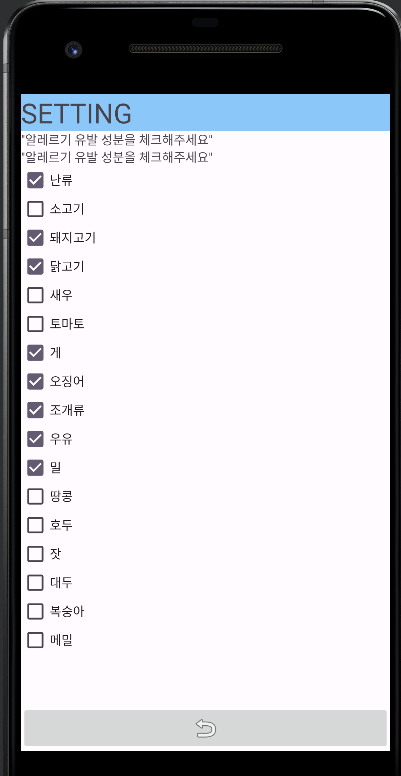

## 빌드 환경
    디버깅 디바이스 : Pixel2 API30
    API level : 30
    Android 버전 : 11

## 디버깅용 test server
    testserver_for_android.py

## APK 다운로드 링크
    [demo_apk](./app-demo.apk)

## 사용 라이브러리
    카메라 및 갤러리 : MediaStore
    이미지 crop : Image Cropper [github](https://github.com/ArthurHub/Android-Image-Cropper)
    서버 통신 : retrofit2
## Directory
front_app  
| -- app_demo.apk (demo)  
| -- app   
&nbsp;&nbsp;&nbsp;&nbsp;&nbsp;| -- java   
&nbsp;&nbsp;&nbsp;&nbsp;&nbsp;| -- res   
&nbsp;&nbsp;&nbsp;&nbsp;└ -- manifests   
 

## 설명
안드로이드 application demo를 위한 폴더로 Android studio와 Kotlin을 이용해 구현되었습니다.   
안드로이드 11 버전을 기준으로 구현되었기에 11 이상의 버전으로 사용해보시는 것을 추천드립니다.
startActivityForResult() 관련 기능이 deprecated된 관계로 intent를 통한 액티비티 호출은 registerForActivityResult()로 구현되어있습니다.

## 핵심 기능
### 0. 초기 화면
카메라 촬영, 갤러리 선택, 세팅버튼 등이 구현되어 있습니다.   

### 1. 이미지 선택
이미지 촬영 및 갤러리 선택 기능은 MediaStore를 통해 호출됩니다.   
이미지는 해상도 유지와 image crop을 위해 캐시 저장소에 임시로 URI로 저장되는 방식으로 구현되어있습니다.
1. 갤러리 이미지 선택   

        Intent(Intent.ACTION_PICK, MediaStore.Images.Media.EXTERNAL_CONTENT_URI)  
        galleryLauncher.launch(intent)    
    
    MediaStore의 갤러리 호출 기능을 사용하였으며, 이미지 선택 성공 시 해당 이미지의 URI를 가져옵니다.   
    
2. 이미지 촬영   

        Intent(MediaStore.ACTION_IMAGE_CAPTURE)   
        intent.putExtra(MediaStore.EXTRA_OUTPUT,uri)   
        cameraLauncher.launch(intent)   

    MediaStore의 이미지 촬영 기능을 사용하였으며, 이미지 해상도 보존을 위해 uri에 이미지를 저장하는 방식으로 구현됐습니다.   
    

### 2. 이미지 Crop
Image crop 기능은 Image cropper 라이브러리를 사용하였으며, URI를 전달받아 해당 이미지를 crop하는 라이브러리입니다.   
모델은 input으로 (224,224) 크기의 이미지를 사용하기 때문에 전송할 데이터의 크기를 줄이고 서버의 resize 연산 부담을 줄이기 위해 어플리케이션에서 crop한 이미지를 보내도록 구현했습니다.    

    val crop_activity = CropImage.activity(uri)
                    .setGuidelines(CropImageView.Guidelines.ON)
                    .setAspectRatio(1,1)
    val crop_intent = crop_activity.getIntent(this)
    cropLauncher.launch(crop_intent)

사용할 이미지 선택이 성공하면 바로 image crop activity를 호출합니다. 이때, 이미지는 종횡비 1:1로 고정되어 crop됩니다.

    val cropLauncher = registerForActivityResult(ActivityResultContracts.StartActivityForResult()) { result ->
            if (result.resultCode == RESULT_OK) {
                val crop_result = CropImage.getActivityResult(result.data)

                SHARED_DATA.bitmap = ImageDecoder.decodeBitmap(ImageDecoder
                    .createSource(application.contentResolver,crop_result.uri))
                SHARED_DATA.bitmap = Bitmap.createScaledBitmap(SHARED_DATA.bitmap!!,224,224,true)
                val out_stream = ByteArrayOutputStream()
                SHARED_DATA.bitmap!!.compress(Bitmap.CompressFormat.JPEG,100,out_stream)
                SHARED_DATA.image_byte = out_stream.toByteArray()
                binding.cameraImgView.setImageBitmap(SHARED_DATA.bitmap)
                binding.connectServer.isEnabled = true
            }
        }

만약 crop도 성공한다면 해당 이미지를 (224,224)크기로 resize하여 bitmap을 메모리에 저장하고 서버로 전송하기위해 jpeg format으로 처리합니다.   
  

### 3. 이미지 전송   
Image crop까지 성공했다면 서버로 데이터를 보내는 send 버튼이 활성화됩니다.   
서버 통신 기능은 retrofit2를 사용하여 구현했으며, 데이터 파싱은 Gson 라이브러리를 사용했습니다.
    
    data class clientData(
        val image: ByteArray,
    )

    data class serverData(
        @SerializedName("result")
        var resultData: List<resultData>
    )
    
    data class resultData(
        @SerializedName("class")
        val class_name: String,
        @SerializedName("recipe")
        val recipes: List<String>,
        @SerializedName("valid")
        val valid: Boolean
    )

    interface RetrofitService {
        @POST("/upload")
        fun getResult(@Body data: clientData) : Call<serverData>
    }
서버로부터 전송받는 데이터는 resultData 양식에 맞춰 항상 3개의 결과를 리스트로 전달받습니다. 해당 리스트는 confidence score에 따라 정렬되어 있습니다. 

### 4. 결과값 출력
서버의 결과값을 출력하는 창은 사용자 편의성을 위하여 BottomSheet Fragment로 구현되었습니다.   
서버로부터 전송받은 데이터가 존재할 경우 활성화되며, 기본적으로 1개의 메인 결과값과 2개의 서브 결과값을 보여줍니다.   
메인 결과에 대한 정보만 알레르기 유발물질을 보여주며, 서브 결과는 클릭할 때 메인 결과와 위치를 바꿔 볼 수 있습니다.   
  

### 5. 알레르기 체크리스트 세팅
사용자는 오른쪽 상단의 setting 버튼을 눌러 자신의 알레르기 유발 재료들을 미리 체크할 수 있으며, 체크리스트에 설정된 재료들은 서버에서 전송받은 데이터와 매칭시켜 빨간색 글씨로 경고를 줍니다.
사용자가 체크해 둔 재료들은 휴대폰에 저장되어 재시작하더라도 유지됩니다.   
 

## 시연 영상   
 

## 추후 개선 사항
1. 메인 액티비티의 server connect 관련 함수들을 따로 객체화하여 분리
2. 결과 출력 액티비티의 UI 디자인 및 기능 개편
3. 전체적인 코드 리팩토링