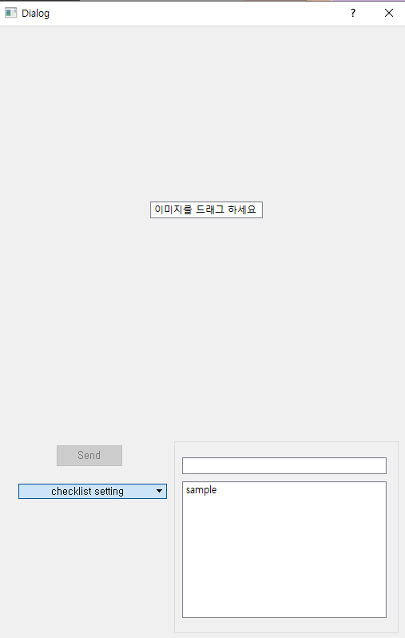
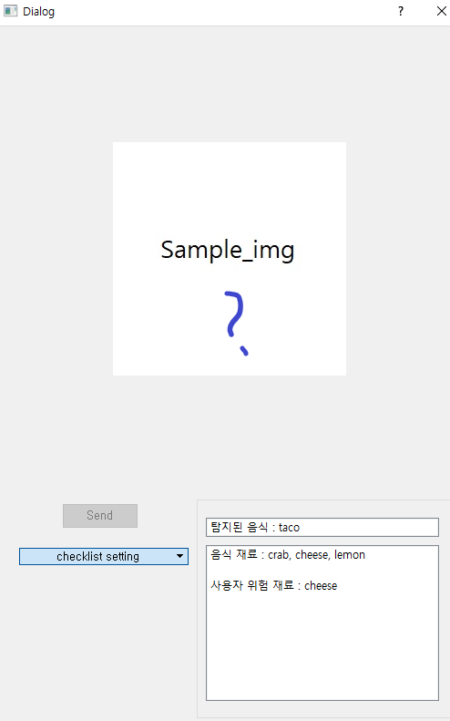
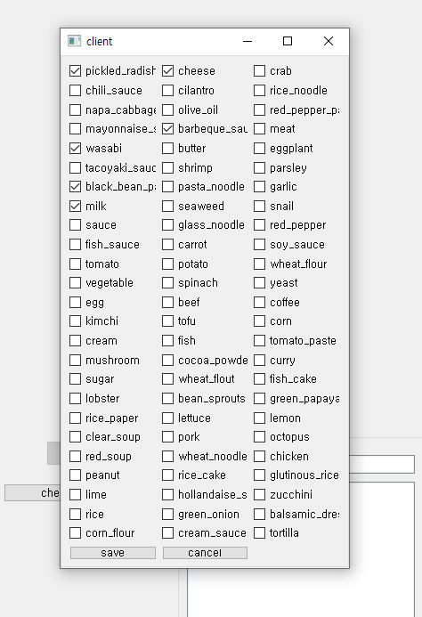

## 빌드
    pyinstaller [-w] [-F] client.py
## client 사용법
    1. python client.py
    2. pyinstaller로 client.py를 빌드한 뒤 사용. 단, dist/client 폴더에 config.json 복사 
## server 사용법
    test_server.py 실행
## client의 target ADDR(IP,PORT) 변경 방법
    config.json에서 IP와 PORT 값 변경
## Directory
frontend  
| -- client.py  
| -- client_process.py  
| -- load_config.py  
| -- server.py  
| -- pyqt_ui_prototype.py  
| -- config.json  
| -- build  
| -- test_server.py  
&nbsp;&nbsp;&nbsp;&nbsp;&nbsp;└ build  
&nbsp;&nbsp;&nbsp;&nbsp;&nbsp;└ dist  
&nbsp;&nbsp;&nbsp;&nbsp;&nbsp;&nbsp;&nbsp;&nbsp;&nbsp;&nbsp;└client.exe  

## 설명
client 프로토타입 프로그램은 PyQt5를 통해 개발되었습니다.  
image를 드래그앤드랍으로 로드한 뒤 send 버튼을 눌러 서버로 데이터를 보냅니다.  
send 버튼은 이미지가 로드된 경우에만 활성화 됩니다.  

사용자의 checklist는 config.json에 저장되며, 프로그램 시작시 자동으로 불러옵니다.  

1. 초기 실행 화면  
  
2. 이미지 드롭 후 전송 화면  
  
3. checklist 설정 화면  
  